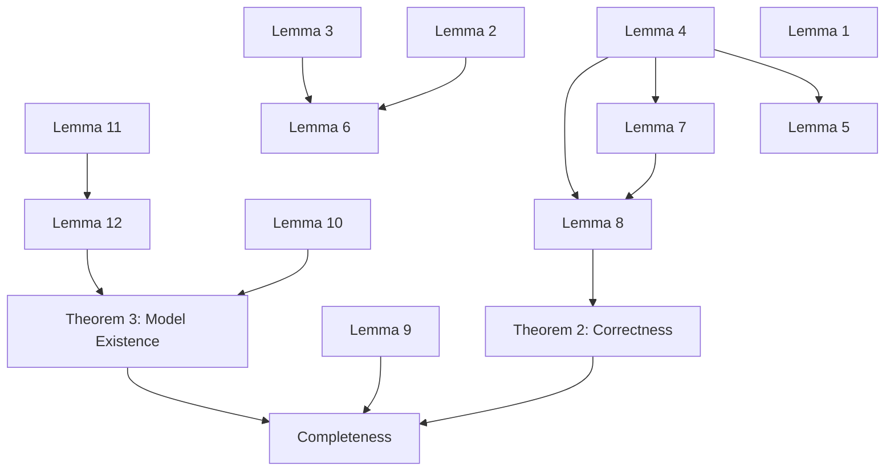

# Tableau for Modal Logic in LEAN

This is an attempt to formalise <https://malv.in/2020/borzechowski-pdl/>.

For now we only aim for the analogue in basic modal logic (K), and not yet PDL.

## Quick How To

First install Lean and tools: <https://leanprover-community.github.io/get_started.html>

Then clone this repository and run `leanproject build`.

## Inspiration / References

- https://github.com/ljt12138/Formalization-PAL

- https://github.com/paulaneeley/modal

- https://github.com/LudvikGalois/coq-CPL-NNF-tableau

- https://github.com/m4lvin/modal-tableau-interpolation

- https://github.com/FrancescaPerin/BScProject

## Basic Modal Logic

- [x] Soundness
- [ ] Completeness
- [ ] Interpolation

Module dependency overview:

## Section 1 ToDo list

Following the enumeration by Borzechowski

| Number    | statement/                               | def | proof | file             |
|-----------|------------------------------------------|-----|-------|------------------|
| Def 1     | formulas and programs                    | X   | -     | syntax           |
| Def 2     | Kripke models                            | X   | -     | semantics        |
| Def 3     | semantics                                | X   | -     | semantics        |
| Def 4     | satisfiable                              | X   | -     | semantics        |
| Example 1 | four valid formulas                      |     |       |                  |
| Def 5     | semantic consequence                     | X   | -     | semantics        |
| Theorem 1 | small model property                     |     |       |                  |
| Def 6     | structures, nodes, paths, end nodes      |     | -     |                  |
| Def 7     | trees                                    |     | -     |                  |
| Def 8     | tableaus                                 | X   | -     | tableau          |
| Def 9     | closed sets, simple sets, projection     | X   | -     | tableau          |
| Lemma 1   | simple set sat iff !closed + allproj sat | X   | DONE  | soundness        |
| page 13   | basic modal rules                        |     |       |                  |
| Example 2 | tableau `{r∧¬[A]p,r→[A](p∧q)}`           | X   | sorry | tableau-examples |
| Def 10    | n-formulas                               |     |       |                  |
| Def 11    | classical rules, local rules, cond 1-4   |     |       |                  |
| Def 12    | maximal tableau                          |     |       |                  |
| Lemma 2   | existence of maximal local tableau       |     |       |                  |
| page 20   | measure definition                       |     |       |                  |
| Lemma 3   | if s<t in loctab, then x(s)≠x(t)         |     |       |                  |
| Lemma 4   | ??? normal successors                    |     |       |                  |
| Lemma 5   | loctab: root true iff some end node true |     |       |                  |
| Def 13    | un/critical paths, loaded paths          |     |       |                  |
| page 24   | PDL rules, rules for marked formulas     |     |       |                  |
| Def 14    | PDL tableau, extra cond 5-7              |     |       |                  |
| Lemma 6   | maximum tableau length                   |     |       |                  |
| Def 15    | ◃ and ≤ between tableau nodes            |     |       |                  |
| Lemma 7   | ¬[a]P node has ¬P succesor iff sat       |     |       |                  |
| Lemma 8   | free sat nodes have normal successors    |     |       |                  |
| Def 16    | closed tableau                           | X   | -     | tableau          |
| page 29   | tableau `{¬[(Aup?)*]q,[A*]q}`            |     |       |                  |
| Def 17    | in/consistent                            | X   | -     | tableau          |
| Theorem 2 | Correctness                              | X   | DONE  | soundness        |
| Def 18    | saturated                                |     |       |                  |
| Def 19    | model graph                              | X   | -     | modelgraphs      |
| Lemma 9   | truth lemma                              | X   | DONE  | modelgraphs      |
| Def 20    | program relations between tableau nodes  |     |       |                  |
| Lemma 10  | existence of free normal successors      |     |       |                  |
| Lemma 11  | all ffns incons, then incons             | X   |       | completeness     |
| Def 21    | X⁻ (remove markings) and lifted incons   |     |       |                  |
| Def 22    | saturating tableau: (at) only on simple  |     |       |                  |
| Theorem 3 | Model Existence                          | X   | todo! | completeness     |
| Theorem 4 | Completeness                             | X   | done  | completeness     |
| Def 23    | extended PDL tableaus                    |     |       |                  |

## Section 1 dependency graph

## other ToDo

- [ ] avoid α and β for formula sets (follow Borzechowski and use X for set)
